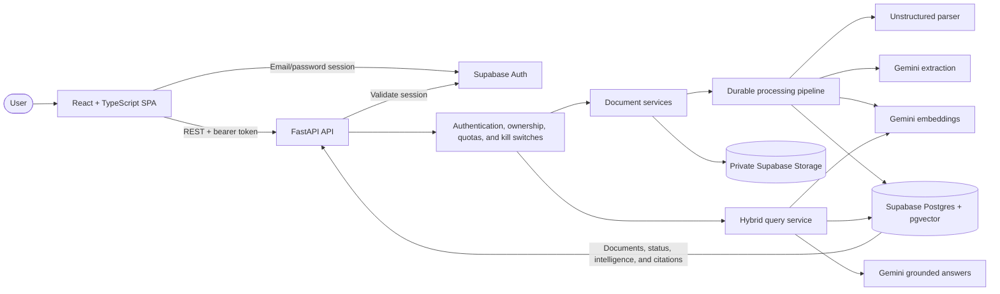

# Document Intelligence

A general-purpose document intelligence platform that turns heterogeneous documents into canonical elements, retrieval-ready chunks, semantic facts, and cited answers.

## Architecture



The API is the security and application boundary: provider credentials stay on the backend,
documents are scoped to their owners, and expensive work passes through configurable quotas
and kill switches. Processing moves durably through `QUEUED → PARSING → EXTRACTING →
EMBEDDING → INDEXING → READY`, with stage-specific failures available for retry. See the
[architecture documentation](docs/architecture.md) for the dependency boundaries.

## Repository

- `apps/web` — React, TypeScript, and Vite frontend
- `apps/api` — FastAPI backend
- `packages/api-client` — frontend API-client boundary
- `supabase` — database migrations and local configuration
- `docs` — architecture and engineering decisions
- `examples` — safe sample documents

## Prerequisites

- Node.js 22 or newer
- pnpm 10
- uv

If uv is installed in its default user location, ensure `$HOME/.local/bin` is on your `PATH`.

## Setup

```bash
make install
cp .env.example .env
make dev
```

The frontend runs at <http://localhost:5173>, the API at <http://localhost:8000>, and API documentation at <http://localhost:8000/docs>. Local development also accepts the equivalent `127.0.0.1` frontend origin.

`make dev` starts both applications, detects uv in its standard user installation location, and supports pnpm installed through Volta or Corepack. Press `Ctrl+C` once to stop both servers and their reload processes. The launcher checks ports `5173` and `8000` before starting, and stops the other application if either server exits.

For the complete local product workflow, start Supabase and inject its local credentials without writing them to `.env`:

```bash
make db-start
make dev-local
```

Open <http://127.0.0.1:5173/sign-up> and create a local email/password account. Local email
confirmation is disabled, so the new session is available immediately. Documents and questions
created through that session are private to its user ID.

## Commands

```bash
make dev          # Run frontend and API
make db-migrate   # Apply pending local migrations without deleting data
make test         # Run tests
make lint         # Run linters
make typecheck    # Run static type checks
make format       # Format the codebase
make check        # Run every verification step
make live-e2e     # Run provider-backed upload-to-answer smoke test
```

Legacy ownership inspection and application commands are documented in the
[ownership rollout runbook](docs/ownership-rollout.md).

Stage 1 focuses on a complete, authenticated upload-to-cited-answer vertical slice. Billing,
organization sharing, distributed queues, and dedicated search infrastructure remain deferred.

## Documentation

- [Engineering decision log](decisions.md)
- [Stage 1 implementation plan](docs/implementation-plan.md)
- [Authentication and abuse-prevention plan](docs/authentication-and-abuse-prevention-plan.md)
- [Ownership backfill and contract rollout](docs/ownership-rollout.md)
- [Architecture](docs/architecture.md)
- [Database model](docs/database.md)
- [Document upload and lifecycle](docs/document-lifecycle.md)
- [Parsing and canonicalization](docs/parsing-pipeline.md)
- [Semantic enrichment and indexing](docs/semantic-enrichment.md)
- [Retrieval and cited answers](docs/retrieval-and-cited-answers.md)
- [Deployment and operations](docs/deployment.md)
- [Design system](docs/design-system.md)
- [Repository structure](docs/repository-structure.md)
